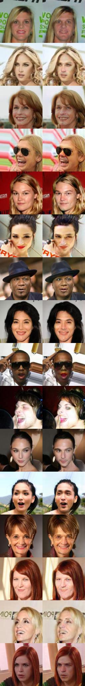

Gender Transformation Using GAN
-------

## Usage

* Install pytorch
* Install tensorflow


Download CelebA dataset
```
cd Code
sh download.sh celeba
```

Run for GAN:

```
cd Code
python3 main.py 
```

Result:
